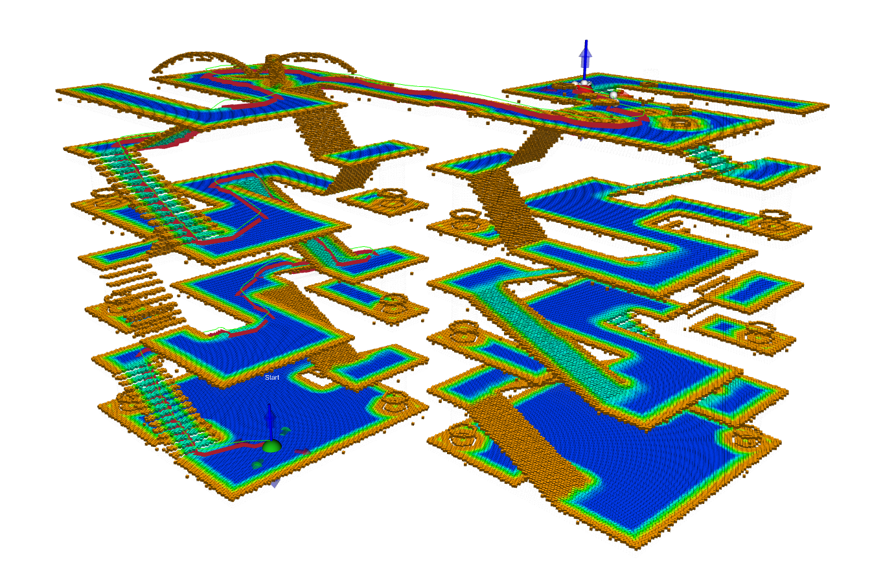
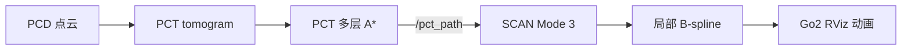
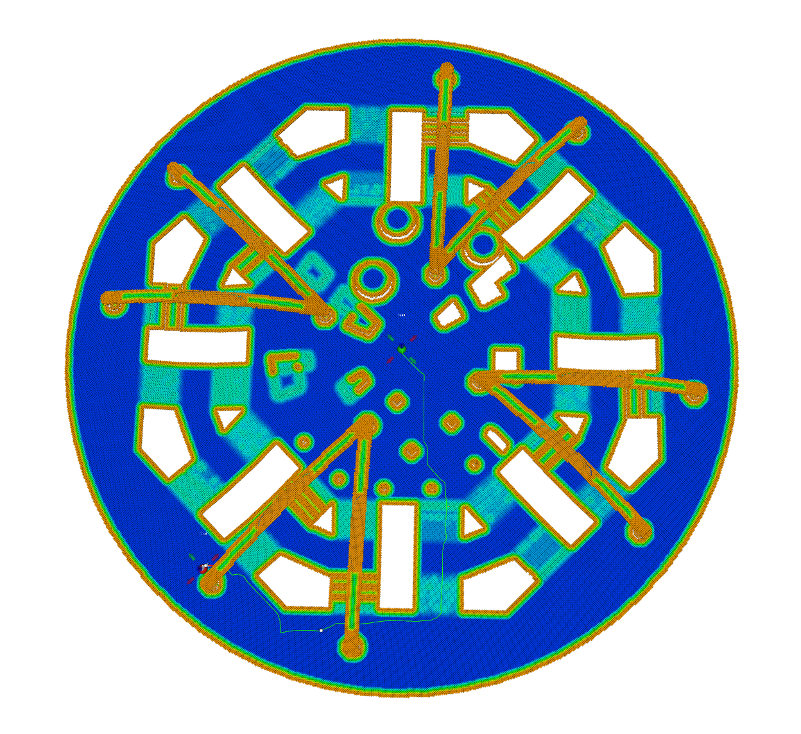
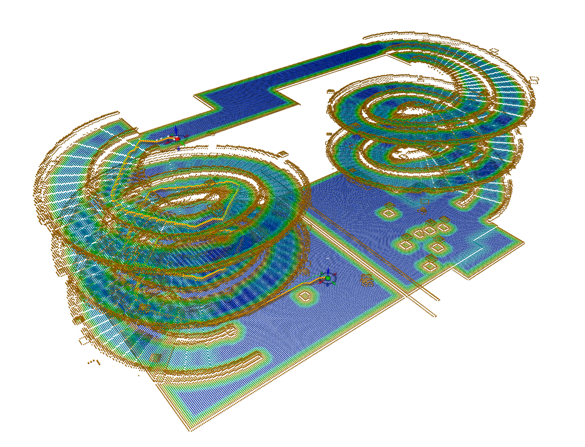

# PCT-SCAN-ROS2

PCT-SCAN-ROS2 将 PCT 的跨层全局规划器与 SCAN 的局部轨迹规划器几何，用 ROS 2 Humble 运行。PCT 负责在 tomogram 层析图中选择楼层、楼梯和坡道，SCAN 沿全局路线持续生成局部 B-spline。RViz 同时显示点云、路线和 Go2 运动动画。

本仓库仅用于验证PCT+SCAN导航算法，起点和终点由 RViz Interactive Marker 控制，Z 轴可以直接选择目标楼层。

<p align="center">
  
</p>

<p align="center"><em>Building：PCT 跨层全局路线与 SCAN 四足局部轨迹跟踪</em></p>

## 系统架构



PCT 提供跨楼层的全局拓扑与路线约束；SCAN 保留其滑动地图、碰撞建模、A\* 引导和
轨迹优化能力，在全局路线的局部窗口内持续重规划。本工程通过 `/pct_path` 将 PCT
的全局结果接入 SCAN Mode 3。

## 已验证场景

| 场景     |                   默认路线 | 验证结果                        | 启动命令                                |
| -------- | -------------------------: | ------------------------------- | --------------------------------------- |
| Building |   地面至上层，约 14 m 高差 | PCT 跨层 A\* + SCAN 连续跟踪    | `./scripts/launch_pct_scan_building.sh` |
| Plaza    |                    37.12 m | PCT A\*；SCAN 进入持续重规划    | `./scripts/launch_pct_scan_plaza.sh`    |
| Spiral   | 38.30 m、3.80 m 爬升、2 层 | PCT A\*；SCAN 连续 5 个以上窗口 | `./scripts/launch_pct_scan_spiral.sh`   |

### Plaza 与 Spiral

<table>
  <tr>
    <td width="50%" align="center">
      <br>
      <strong>Plaza</strong>：平面复杂障碍场景
    </td>
    <td width="50%" align="center">
      <br>
      <strong>Spiral</strong>：螺旋坡道跨层场景
    </td>
  </tr>
</table>

## 环境要求

当前代码针对下面这套环境整理：

- Ubuntu 22.04
- ROS 2 Humble
- Python 3.10
- GCC 11 或兼容的 C++17 编译器
- RViz2

Building 和 Plaza 不需要 CUDA。Spiral 的 tomogram 生成器会先检查 CUDA，GPU 不可用
时改用 NumPy 和 SciPy。运行导航演示本身不需要 NVIDIA 显卡。

## 安装与环境部署

### 1. 获取代码

```bash
git clone https://github.com/yagami-light7/PCT-SCAN-ROS2.git
cd PCT-SCAN-ROS2
```

如果系统还没有 ROS 2 Humble，请先按照 ROS 2 官方文档完成桌面版安装。下面的命令
默认 `/opt/ros/humble/setup.bash` 已经存在。

### 2. 安装 ROS 和系统依赖

```bash
sudo apt update
sudo apt install -y \
  build-essential cmake ninja-build git curl \
  python3-colcon-common-extensions python3-rosdep python3-dev python3-pip python3-venv \
  libboost-all-dev libeigen3-dev \
  libarmadillo-dev libglew-dev libglfw3-dev \
  libgl1-mesa-dev libglu1-mesa-dev
```

第一次使用 rosdep 时先执行：

```bash
sudo rosdep init
rosdep update
```

如果 `rosdep init` 提示配置已经存在，直接执行 `rosdep update`。随后安装工作空间内
各 ROS package 声明的依赖：

```bash
source /opt/ros/humble/setup.bash
rosdep install --from-paths src --ignore-src -r -y
```

### 3. 编译 PCT 原生依赖

PCT 使用 GTSAM 4.2 和 OSQP 1.0。仓库脚本会下载源码并安装到 `.deps/install`，不会
改动 `/usr/local`，也不需要再 source 另一个 PCT 工作空间。

```bash
./scripts/setup_pct_dependencies.sh
```

脚本默认使用两个编译任务。内存充足时可以提高并行数：

```bash
PCT_BUILD_JOBS=6 ./scripts/setup_pct_dependencies.sh
```

### 4. 构建工作空间

```bash
./scripts/build_workspace.sh
source install/setup.bash
```

启动脚本会自行加载 ROS、当前工作空间和 `.deps` 中的运行库，所以平时可以直接执行
脚本。上面的 `setup.bash` 用于 bash；zsh 用户手动配置当前终端时改用
`source install/setup.zsh`。两种 shell 都应该运行 `./scripts/launch_*.sh`，不要
source 这些启动脚本。

已有 GTSAM 和 OSQP 安装时，可以指定依赖目录：

```bash
PCT_DEPS_ROOT=/path/to/deps ./scripts/build_workspace.sh
```

### 5. 检查安装

先确认 ROS 能找到两个核心包：

```bash
source /opt/ros/humble/setup.bash
source install/setup.bash
ros2 pkg prefix pct_scan_bridge
ros2 pkg prefix scan_planner
```

再运行不带图形界面的路线测试：

```bash
./scripts/test_pct_building_astar.sh --force
./scripts/test_pct_plaza_astar.sh --force
```

两条命令都打印 `[astar] PASS` 才说明 PCT 原生库、pickle 和 Python bridge 已经连通。

## 快速启动

### Building

Building 的资产随仓库提供，适合第一次启动：

```bash
./scripts/launch_pct_scan_building.sh
```

RViz 打开后，选择工具栏中的 `Interact`。拖动绿色 Start 和红色 Goal，跨层时还要
沿蓝色 Z 轴把 Goal 放到目标楼层。右键任一 marker，选择 `Plan route`。

如果只想播放仓库内的默认跨层路线：

```bash
./scripts/launch_pct_scan_building.sh plan_on_startup:=true
```

### Plaza

```bash
./scripts/launch_pct_scan_plaza.sh
```

自动规划默认路线：

```bash
./scripts/launch_pct_scan_plaza.sh plan_on_startup:=true
```

### Spiral

Spiral 源仓库没有明确的资产许可证，因此 PCD 和生成后的 pickle 不随 Git 分发。
第一次使用时运行：

```bash
./scripts/fetch_spiral_asset.sh
./scripts/setup_tomography_env.sh
./scripts/generate_spiral_tomogram.sh
./scripts/test_pct_spiral_astar.sh --force
```

测试通过后启动：

```bash
./scripts/launch_pct_scan_spiral.sh
```

三个场景都可以关闭 RViz 做终端验收：

```bash
./scripts/launch_pct_scan_building.sh \
  use_rviz:=false plan_on_startup:=true \
  publish_tomogram:=false enable_interactive_markers:=false
```

终端应先看到 PCT 发布 `/pct_path`，然后看到 SCAN 接受参考路线，并持续打印
`Received trajectory N`。如果只出现第一条局部轨迹，检查是否残留了从其他工作空间
启动的同名节点。

视频模式默认设置 `enable_local_sensing:=false`。PCD 仍用于场景显示，PCT tomogram
负责地形可通行性。这样可以避免稠密楼梯点云被 SCAN 的碰撞膨胀当成封闭障碍。

## 场景数据

Building 和 Plaza 来自 PCT 官方资源，仓库直接保存运行演示所需的 PCD 与 pickle。
Spiral 来自 3D2M planner。由于源仓库没有明确的资产许可证，Git 只保存下载和生成
脚本。三个场景的来源、参数和文件校验值分别记录在 `assets/<scene>/README.md`。

## 工程结构

```text
PCT-SCAN-ROS2/
├── src/pct/                         # 可构建的 PCT/tomography 源码
├── src/integration/pct_scan_bridge/ # PCT → SCAN ROS 2 桥
├── src/planner/                     # SCAN planner
├── src/simulator/                   # Go2 RViz 动画及原 SCAN 工具
├── assets/                          # 场景、tomogram、验收路线与来源说明
├── scripts/                         # 依赖、生成、测试和启动入口
├── docs/                            # 分阶段教程
├── LICENSES/                        # 上游许可证全文
└── NOTICE                           # 来源与修改声明
```

核心接口：PCT 发布 `/pct_path` (`nav_msgs/Path`)；SCAN Mode 3 订阅后进行三维 RDP
简化和分段线性参考参数化，再发布 `planning/bspline`。分段线性参考用于守住楼梯和
窄通道的全局走廊，平滑只由局部 B-spline 完成。

更完整的原理和调试过程见：

- `docs/tutorial_phase4_pct_scan_bridge.md`
- `docs/tutorial_phase5_route_tracking.md`
- `docs/tutorial_phase7_building_rviz.md`

## 来源与许可证

- SCAN-Planner：<https://github.com/wuyi2121/SCAN-Planner>，Apache-2.0。
- PCT planner：<https://github.com/byangw/PCT_planner>，其 NOTICE 明确为 GPL v2
  或后续版本。
- PCT ROS 2 移植来源：<https://github.com/2473o/PCT_planner/tree/feat/ros2pkg>。
- Spiral/3D2M：<https://github.com/ZJU-FAST-Lab/3D2M-planner>，当前未发现明确
  许可证，因此不随 Git 分发其资产。

本仓库不是一个可以用单一 Apache-2.0 覆盖所有文件的工程。SCAN 包继续使用
Apache-2.0；PCT、tomography 和直接派生的 bridge 使用 GPL-2.0-or-later；其他
ROS 包保留各自 package.xml 声明的 GPL-3.0-only 或 BSD-3-Clause。完整映射见
[`LICENSE`](LICENSE)、[`NOTICE`](NOTICE)、
[`THIRD_PARTY_NOTICES.md`](THIRD_PARTY_NOTICES.md)、`src/pct/NOTICE` 和
`LICENSES/`。

这是一份工程侧许可证审计，不构成法律意见。公开发布或商业使用前应再次核对每个
第三方 asset 与依赖的授权条件。
